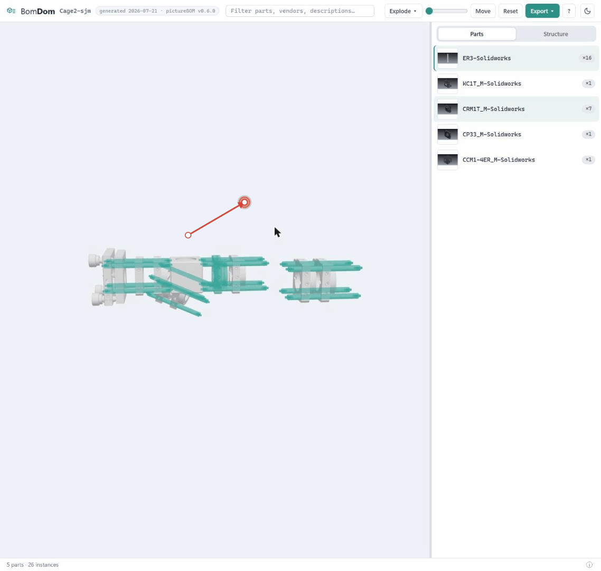
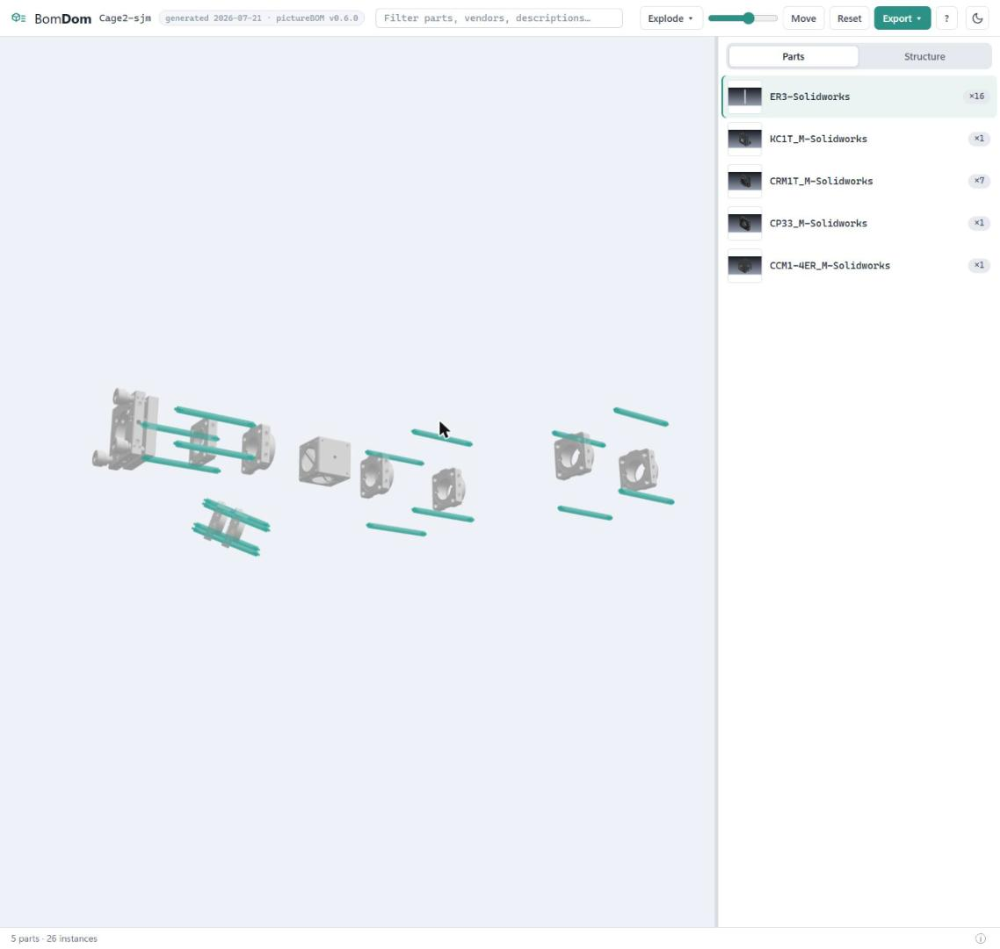

# pictureBOM

Automatically capture isometric images of every part in a SolidWorks assembly and generate an Excel Bill of Materials with embedded thumbnails — plus an interactive **3D BOM in a single HTML file** anyone can open in a browser.

<p align="center">
  
</p>

<p align="center">
  
</p>

**Try the real thing** (generated from the example cage assembly, no install needed):
[**⬇ Cage2-sjm_BomDom.html**](docs/samples/Cage2-sjm_BomDom.html) — download the raw file and double-click it (works fully offline) · [**⬇ Cage2-sjm_pictureBOM.xlsx**](docs/samples/Cage2-sjm_pictureBOM.xlsx) — the matching Excel picture BOM (Microsoft 365 Excel shows the in-cell pictures).

## What it does

Point pictureBOM at a SolidWorks assembly file (`.sldasm`). It will:

1. Open each part in SolidWorks and take an isometric screenshot
2. Build an Excel spreadsheet with a picture of every component alongside its part number, description, vendor, and quantity

Pictures are embedded **in the cells** (Excel's "Place in Cell"), so they sort and filter with their rows, and resizing rows resizes every picture at once. Each BOM also ships ready for part tracking:

- A **Status** column with a dropdown (To Order / Ordered / Received / Installed)
- A **Vendor** dropdown seeded with the vendors found in your assembly plus common ones, with automatic color highlighting (McMaster-Carr yellow, Thorlabs red, Unknown gray)
- **Clickable product links** on Vendor Part No for Thorlabs and McMaster-Carr parts

The output Excel file is named after the assembly with a timestamp (e.g. `MainFrame_2026-04-14_143025.xlsx`) so consecutive runs never overwrite each other.

It can also **compare two BOMs** to show which parts you still need to order.

### 3D interactive BOM (BomDom)

Check **3D interactive BOM (.html)** under *Outputs* and the same run also produces a
**single HTML file** containing an interactive 3D view of your assembly with a synced
parts list. Send that one file to a teammate — they double-click it and can:

- Rotate, pan and zoom the assembly; hover or click a part to highlight its BOM row
  (and vice versa)
- Hide, isolate, or make transparent any part or subassembly — for one instance or
  **all instances at once**
- Drag parts aside and snap them back; explode the whole assembly with a slider
- Export their own parts list straight from the viewer (Excel with thumbnails, CSV,
  or a printable order sheet) — scoped to what they have selected or visible.
  Don't want recipients re-exporting? Uncheck *Allow exporting parts lists from
  the 3D viewer* before running — and you can change your mind later by opening
  the HTML in a text editor and flipping the `allow_exports` value near the top

The file works completely offline (nothing is downloaded or uploaded), in any modern
browser. Requirements and notes:

- **Exporting** the 3D BOM needs **SolidWorks 2024 or newer** (the Extended Reality
  .glb exporter). Viewing needs only a browser — any machine, no SolidWorks.
- Only components **visible** in the model at export time get 3D geometry; hidden
  parts still appear in the list, badged "not in 3D view".
- Very large assemblies (over ~25 MB projected) are split into an `.html` plus a
  `.glb` data file — keep the two together; the page asks for the `.glb` when opened.
- To share just part of a machine, run pictureBOM on the subassembly's `.sldasm`.
- Emailed HTML files carry Windows' mark-of-the-web; if SmartScreen interposes on
  first open, choose "Keep" / "Run anyway" — the file is inert HTML + JavaScript.

## Requirements

- **Windows** (SolidWorks is Windows-only)
- **SolidWorks** installed and running before you click Run
- **Microsoft 365 Excel** (or Excel 2024+) to see the in-cell pictures — older Excel versions show `#VALUE!` in the Picture column

That's it — no Python installation needed; the installer takes care of everything else.

> **Important:** Pack and Go your assembly before running. Files locked in PDM will not open correctly.

## Install

Paste this into **PowerShell** and press Enter:

```
powershell -ExecutionPolicy Bypass -c "irm https://raw.githubusercontent.com/deereeco/pictureBOM/main/install.ps1 | iex"
```

The installer:

1. Installs [git](https://git-scm.com) and [uv](https://docs.astral.sh/uv/) if they're missing (uv downloads its own Python, so you don't need Python installed)
2. Installs pictureBOM
3. Creates a **Start Menu shortcut**

Then launch **pictureBOM** from the Start Menu. A browser tab opens automatically at `http://127.0.0.1:5000`.

### Update

```
uv tool upgrade picturebom
```

### Uninstall

```
uv tool uninstall picturebom
```

(Then delete the Start Menu shortcut if you created one.)

## Usage

1. Open SolidWorks with your assembly (or have it accessible on disk).
2. Launch pictureBOM from the Start Menu (or run `picturebom-gui` in a terminal).
3. Set the **Assembly File** path to your `.sldasm` file.
4. Set the **Output Directory** where images and the Excel BOM will be saved (defaults to `Documents\pictureBOM`).
5. Choose your **Image Quality** and **Assembly Mode**:
   - **Parts only (flat)** -- every unique part listed once with total quantity
   - **Include sub-assemblies (nested)** -- hierarchical list including sub-assemblies
   - **Linked (two-sheet)** -- Sheet 1 is an editable parts list, Sheet 2 is a hierarchical view linked by formulas
6. Click **Run pictureBOM**.
7. When complete, use **Open Output Folder** to find your files or **Download Copy of BOM** to grab the Excel through the browser.

### Compare BOMs

The **Compare BOMs** panel shows which parts you still need to order: pick the BOM for parts you already have and the BOM for the assembly you want to build, and it produces a shortage list (on screen and as an Excel file).

## Shutting down

- Use the **Quit** button in the top-right corner to shut down the server.
- Or close the pictureBOM console window / press **Ctrl+C** in it.

## Command-line interface

For scripting or automation, a CLI is also available:

```
picturebom path\to\assembly.sldasm -o output_folder
```

Run `picturebom --help` for all options.

## Troubleshooting

- **"SolidWorks is not running"** — open SolidWorks first, then click Run again.
- **Port 5000 already in use** — launch with a different port: set the `PORT` environment variable (e.g. `$env:PORT=5050; picturebom-gui`).
- **PowerShell blocks the install script** — the one-liner above already bypasses the execution policy for that single command; if you downloaded `install.ps1` manually, right-click it → Properties → Unblock.
- **Parts fail to open** — Pack and Go the assembly first; files locked in PDM will not open correctly.

## Developer setup

```
git clone https://github.com/deereeco/pictureBOM.git
cd pictureBOM
uv run picturebom-gui
```

Project structure:

```
pictureBOM/
  src/picturebom/
    app.py        -- Flask web GUI (entry point: picturebom-gui)
    cli.py        -- Command-line interface (entry point: picturebom)
    core.py       -- Core library (SolidWorks COM, image capture, Excel generation)
    bomdom.py     -- 3D interactive BOM: GLB post-processing + HTML assembly
    templates/    -- HTML template (Flask GUI)
    static/       -- JavaScript, CSS
    assets/bomdom/viewer_template.html -- committed viewer build artifact
  web/            -- BomDom viewer source (Node needed only to rebuild the template:
                     cd web && npm install && npm run build)
  scripts/        -- smoke tests (smoke_excel.py, smoke_bomdom.py), viewer build,
                     preview harness (preview_bomdom.py, no SolidWorks needed)
  install.ps1     -- One-line installer for end users
```

### Releasing

`main` is the release channel — `uv tool upgrade picturebom` installs whatever `main` points at, so keep `main` shippable. To cut a release: bump `version` in `pyproject.toml`, commit, tag (`git tag v0.3.0`), and push with tags.
