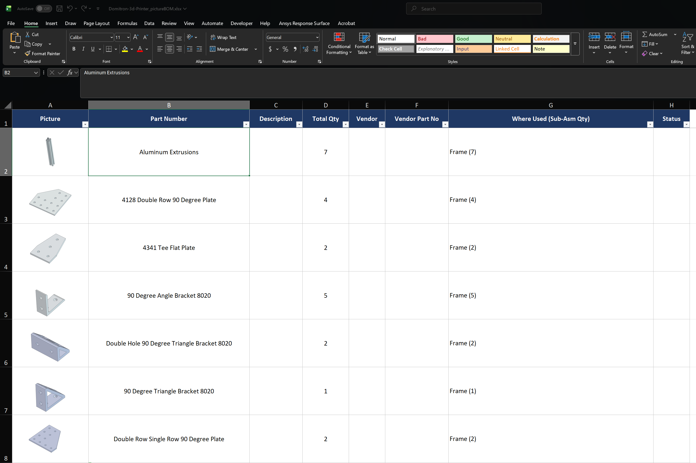
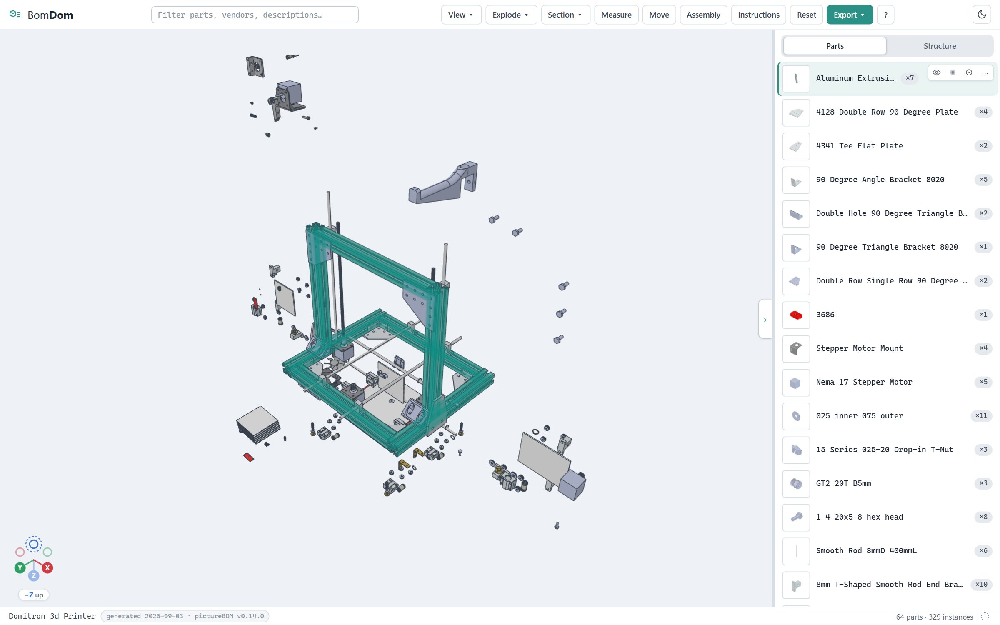

# pictureBOM

Automatically capture isometric images of every part in a SolidWorks assembly and generate an Excel Bill of Materials with embedded thumbnails — plus an interactive **3D BOM in a single HTML file** anyone can open in a browser.

**The Excel picture BOM** — a thumbnail of every part embedded in its row, with quantities, where-used, vendor columns and a tracking dropdown. This one is a complete 3D printer read from a STEP file, so the vendor columns start out blank:

<p align="center">
  
</p>

**The 3D interactive BOM (BomDom)** — one HTML file with a live 3D view synced to the parts list; here the same printer mid-explode with all seven frame extrusions selected:

<p align="center">
  
</p>

<!-- TODO: demo video of the BomDom viewer (recorded walkthrough) -->


**See it live, no install needed:** [**deereeco.github.io/pictureBOM**](https://deereeco.github.io/pictureBOM/) — the 3D BOM of that printer (64 parts, read from a STEP file with FreeCAD) opens straight in your browser. It is one self-contained HTML file: save the page and it works offline too.

**The matching Excel file:** [**⬇ Domitron-3d-Printer_pictureBOM.xlsx**](docs/samples/Domitron-3d-Printer_pictureBOM.xlsx) — the Excel picture BOM of the same printer (Microsoft 365 Excel shows the in-cell pictures).

## What it does

Point pictureBOM at a SolidWorks assembly file (`.sldasm`). It will:

1. Open each part in SolidWorks and take an isometric screenshot
2. Build an Excel spreadsheet with a picture of every component alongside its part number, description, vendor, and quantity

Pictures are embedded **in the cells** (Excel's "Place in Cell"), so they sort and filter with their rows, and resizing rows resizes every picture at once. Each BOM also ships ready for part tracking:

- A **Status** column with a dropdown (To Order / Ordered / Received / Installed)
- A **Vendor** dropdown seeded with the vendors found in your assembly plus common ones, with automatic color highlighting (McMaster-Carr yellow, Thorlabs red, Unknown gray)
- **Clickable product links** on Vendor Part No for Thorlabs and McMaster-Carr parts
- **Your own part properties as columns**: list SolidWorks custom property names
  (e.g. `Process, Finish`) under *Advanced* in Export options (`--properties` on the
  CLI) and each becomes a column. Every sheet also gets a **header autofilter**, so
  the team can filter to just the machined parts right in Excel (on the nested
  layout filtering hides the assembly context rows — the flat and linked Parts
  sheets filter best)

The output Excel file is named after the assembly with a timestamp (e.g. `MainFrame_2026-04-14_143025.xlsx`) so consecutive runs never overwrite each other.

It can also **compare two BOMs** to show which parts you still need to order.

### 3D interactive BOM (BomDom)

Check **3D interactive BOM (.html)** under *Outputs* and the same run also produces a
**single HTML file** containing an interactive 3D view of your assembly with a synced
parts list. Send that one file to a teammate — they double-click it and can:

- Rotate, pan and zoom the assembly; click a part to highlight its BOM row, or hover a
  BOM row to light up the part in 3D
- Set **which way is up** (View menu, or the colour-coded X/Y/Z gizmo in the corner)
  and snap to standard views — Iso, Top, Front, Right and the rest. Pick the default
  for recipients with *Which way is up in the 3D view* before running (`--up-axis` on
  the CLI); it is hand-editable afterwards via the `up_axis` value near the top of the
  HTML. Only the camera turns — X/Y/Z always mean the model's own axes
- Hide, isolate, or make transparent any part or subassembly — for one instance or
  **all instances at once**
- **Assembly mode** (press `A`): hovering highlights the subassembly under the
  cursor and a click selects it whole — then hide (`H`), isolate (`I`) or **open**
  (`O`) it. Opening scopes the view to just that subassembly, with *up a level* and
  *top* buttons in the corner to climb back out; the Structure tab mirrors the real
  assembly tree (each subassembly copy its own row, duplicate parts rolled up ×N)
- **Filter by your part properties** (set them under *Advanced* before running):
  click a value chip — say *Process: Machined* — and everything else ghosts out
  (or hides, for clean screenshots). Filters stack, the search box matches
  property values too, and a **color-by-property** mode paints the assembly by
  value with a legend — instant "which parts are machined" for a design review
- Drag parts aside and snap them back; explode the whole assembly with a slider
- **Measure** (press `D`): click two points for distances with live X/Y/Z deltas —
  picks snap to corners and feature edges, hole rims and bores read back as true
  fitted diameters, flat faces measure face-to-face, and hole readouts offer
  center/min/max just like SolidWorks Measure. Every value carries an honest
  ± bound (about ±0.01 mm on typical parts) and a unit switcher (µm, mm, cm,
  m, in, ft, feet + inches)
- **Section view** (press `X`): cut the model open along any model axis with a
  position slider and flip control — cut cross-sections are outlined so the
  open interiors read clearly
- Export their own parts list straight from the viewer (Excel with thumbnails, CSV,
  or a printable order sheet) — scoped to what they have selected or visible.
  Don't want recipients re-exporting? Uncheck *Allow exporting parts lists from
  the 3D viewer* before running — and you can change your mind later by opening
  the HTML in a text editor and flipping the `allow_exports` value near the top

The file works completely offline (nothing is downloaded or uploaded), in any modern
browser. Requirements and notes:

- **Exporting** the 3D BOM needs **SolidWorks 2024 or newer** (the Extended Reality
  .glb exporter). Viewing needs only a browser — any machine, no SolidWorks.
- Only components **visible** in the model at export time get 3D geometry; hidden
  parts still appear in the list, badged "not in 3D view".
- Almost every assembly ships as one self-contained `.html`. Only past ~400 MB —
  more than a browser can decode from a single file — is the export split into an
  `.html` plus a `.glb` data file; keep the two together, the page asks for the
  `.glb` when opened. Files over ~100 MB may open slowly on tablets.
- To share just part of a machine, run pictureBOM on the subassembly's `.sldasm`.
- Emailed HTML files carry Windows' mark-of-the-web; if SmartScreen interposes on
  first open, choose "Keep" / "Run anyway" — the file is inert HTML + JavaScript.

## Requirements

- **Windows** (SolidWorks is Windows-only)
- **SolidWorks** installed and running before you click Run — for `.sldasm` assemblies
- **FreeCAD 1.0 or newer** (free: `winget install FreeCAD.FreeCAD`) — only for **STEP files**, which pictureBOM reads without SolidWorks (see [STEP files](#step-files))
- **Microsoft 365 Excel** (or Excel 2024+) to see the in-cell pictures — older Excel versions show `#VALUE!` in the Picture column

That's it — no Python installation needed; the installer takes care of everything else.

> **Important:** Pack and Go your assembly before running. Files locked in PDM will not open correctly.

## Install

Paste this into **PowerShell** and press Enter:

```
powershell -ExecutionPolicy Bypass -c "irm https://raw.githubusercontent.com/deereeco/pictureBOM/main/install.ps1 | iex"
```

The installer:

1. Installs [git](https://git-scm.com) and [uv](https://docs.astral.sh/uv/) if they're missing (uv downloads its own Python, so you don't need Python installed)
2. Installs pictureBOM
3. Creates a **Start Menu shortcut**

Then launch **pictureBOM** from the Start Menu. A browser tab opens automatically at `http://127.0.0.1:5000`.

### Update

```
uv tool upgrade picturebom
```

### Uninstall

```
uv tool uninstall picturebom
```

(Then delete the Start Menu shortcut if you created one.)

## Usage

1. Open SolidWorks with your assembly (or have it accessible on disk).
2. Launch pictureBOM from the Start Menu (or run `picturebom-gui` in a terminal).
3. Set the **Assembly or STEP file** path to your `.sldasm` — or to a `.step` / `.stp` file (see [STEP files](#step-files) below).
4. Set the **Output Directory** where images and the Excel BOM will be saved (defaults to `Documents\pictureBOM`).
5. Choose your **Image Quality** and **Assembly Mode**:
   - **Parts only (flat)** -- every unique part listed once with total quantity
   - **Include sub-assemblies (nested)** -- hierarchical list including sub-assemblies
   - **Linked (two-sheet)** -- Sheet 1 is an editable parts list, Sheet 2 is a hierarchical view linked by formulas
6. Click **Run pictureBOM**.
7. When complete, use **Open Output Folder** to find your files or **Download Copy of BOM** to grab the Excel through the browser.

### Rerunning without SolidWorks

Every run writes a plain `.csv` of the parts list next to its `.xlsx`. To rebuild
the outputs later — new image quality, the 3D BOM you skipped the first time, an
edited parts list — fill in **Advanced**: *Existing BOM* (that `.csv`, **or the
`.xlsx` itself**), *Existing images folder*, and for a 3D BOM the kept
`_raw.glb`. With all three filled in the run never touches SolidWorks, so it
takes seconds instead of minutes. Edit the CSV first and the rebuilt BOM picks up
your changes; rerun from the `.xlsx` instead and anything you have marked in its
**Status** column comes across too.

### STEP files

Point pictureBOM at a `.step` / `.stp` file instead of a `.sldasm` and it reads the
file with **FreeCAD** (free and open source — `winget install FreeCAD.FreeCAD`). The
part names, assembly tree and quantities come from the STEP file itself; FreeCAD
renders the part pictures and exports the 3D model for the interactive BOM.
SolidWorks is not involved, so this works on any Windows machine with FreeCAD
installed — handy for assemblies that arrive as STEP from a vendor or customer,
for single vendor parts, and for machines without a SolidWorks licence.

- A STEP file carries **no SolidWorks custom properties**, so Description, Vendor and
  Vendor Part No come out blank (the dropdowns and product links still work once you
  fill them in), and part properties configured under *Advanced* stay empty.
- Pictures come from FreeCAD's renderer: shaded with dark feature edges on white,
  isometric — close to SolidWorks' captures, not pixel-identical.
- A STEP that is **one part with several bodies** (vendors often flatten an assembly
  this way) asks, as soon as you pick the file, whether to list it as one part or as
  an assembly with one row and picture per body (`--step-as` on the CLI).
- pictureBOM finds FreeCAD in the usual install folders. If it lives elsewhere, set
  *FreeCAD location* under *Advanced* (`--freecad` on the CLI). FreeCAD runs with its
  own private settings, so your FreeCAD preferences are never touched.
- Reading STEP files through SolidWorks instead of FreeCAD is planned for a later
  version; the engine choice is already in the UI.

### Compare BOMs

The **Compare BOMs** panel shows which parts you still need to order: pick the BOM for parts you already have and the BOM for the assembly you want to build, and it produces a shortage list (on screen and as an Excel file).

## Shutting down

- Use the **Quit** button in the top-right corner to shut down the server.
- Or close the pictureBOM console window / press **Ctrl+C** in it.

## Command-line interface

For scripting or automation, a CLI is also available:

```
picturebom path\to\assembly.sldasm -o output_folder
picturebom path\to\model.step -o output_folder --html      # read with FreeCAD
```

Run `picturebom --help` for all options.

## Troubleshooting

- **"SolidWorks is not running"** — open SolidWorks first, then click Run again.
- **Port 5000 already in use** — launch with a different port: set the `PORT` environment variable (e.g. `$env:PORT=5050; picturebom-gui`).
- **PowerShell blocks the install script** — the one-liner above already bypasses the execution policy for that single command; if you downloaded `install.ps1` manually, right-click it → Properties → Unblock.
- **Parts fail to open** — Pack and Go the assembly first; files locked in PDM will not open correctly.

## Developer setup

```
git clone https://github.com/deereeco/pictureBOM.git
cd pictureBOM
uv run picturebom-gui
```

Project structure:

```
pictureBOM/
  src/picturebom/
    app.py        -- Flask web GUI (entry point: picturebom-gui)
    cli.py        -- Command-line interface (entry point: picturebom)
    core.py       -- Core library (SolidWorks COM, image capture, Excel generation)
    bomdom.py     -- 3D interactive BOM: GLB post-processing + HTML assembly
    templates/    -- HTML template (Flask GUI)
    static/       -- JavaScript, CSS
    assets/bomdom/viewer_template.html -- committed viewer build artifact
  web/            -- BomDom viewer source (Node needed only to rebuild the template:
                     cd web && npm install && npm run build)
  scripts/        -- smoke tests (smoke_excel.py, smoke_bomdom.py), viewer build,
                     preview harness (preview_bomdom.py, no SolidWorks needed)
  install.ps1     -- One-line installer for end users
```

### Releasing

`main` is the release channel — `uv tool upgrade picturebom` installs whatever `main` points at, so keep `main` shippable. To cut a release: bump `version` in `pyproject.toml`, commit, tag (`git tag v0.3.0`), and push with tags.
